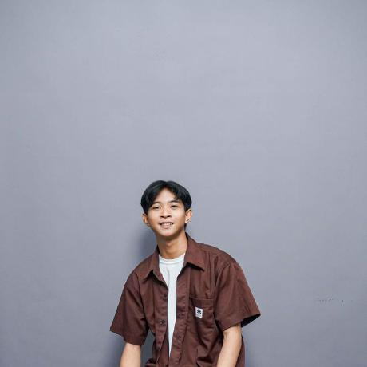

  
  

  

   
  

  

    
    
  

---

### 👨‍💻 About Me

Saya adalah lulusan **D4 Manajemen Informatika** dari **Universitas Negeri Surabaya** dengan **IPK 3.81**. Saya memiliki passion yang kuat dalam pengembangan perangkat lunak, baik berbasis web maupun mobile.

Saya berfokus pada:
* 🌐 **Full-Stack Web Development:** Membangun aplikasi dinamis menggunakan **PHP, Laravel**, dan **Filament**.
* 📱 **Android Development:** Mengembangkan aplikasi mobile modern dengan **Kotlin** dan arsitektur **MVVM**.
* 🔬 **Research:** Penulis terpilih di konferensi internasional **ICASVI 2025**.

---

### 🛠️ Tech Stack & Tools

| **Backend & Web** | **Mobile & AI** | **Tools & DevOps** |
|:-----------------:|:---------------:|:------------------:|
|  |  |  |
|  |  |  |
|  |  |  |
|  |  |  |

---

### 🚀 Featured Projects

#### 🧵 [BATITUNE – E-Commerce Batik Tulis](https://github.com/YOUR_USERNAME/NAMA-REPO)
> *Maret 2025 – Juli 2025 | Proyek Akhir UNESA*

Platform e-commerce untuk digitalisasi UMKM Batik Tulis, mencakup manajemen produk hingga transaksi.
* **Tech Stack:** Laravel, Filament, MySQL, Midtrans.
* **Highlight:** Menggunakan **Laravel Filament** untuk admin panel yang responsif dan interaktif.

#### 🌱 [NVBite – Carbon Emission Detector](https://github.com/YOUR_USERNAME/NAMA-REPO)
> *Sep 2024 – Jan 2025 | Capstone Bangkit Academy*

Aplikasi Android untuk mendeteksi dan mengestimasi emisi karbon dari makanan.
* **Tech Stack:** Kotlin, MVVM, Retrofit, Clean Architecture.
* **Highlight:** Kolaborasi tim lintas fungsi (Cloud, ML, Mobile) menggunakan Git flow yang terstruktur.

#### 💰 [Corporate Cash Management System](https://github.com/YOUR_USERNAME/NAMA-REPO)
> *Feb 2024 – Juli 2024 | Magang PT EDI Indonesia*

Aplikasi web internal untuk manajemen kas perusahaan dan pelaporan keuangan.
* **Tech Stack:** PHP, Laravel, Filament.
* **Highlight:** Merampingkan proses pelaporan manual tim keuangan menjadi sistem digital otomatis.

---

### 🏆 Achievements & Certifications

* 🥇 **Penulis Terpilih (ICASVI 2025):** Mempresentasikan artikel ilmiah tentang inovasi vokasional pada *The 2nd International Conference on Aligning Sustainability with Vocational Innovations*.
* 🎓 **Graduate Bangkit Academy 2024:** Lulusan program Mobile Development (Kotlin & Android).
* 📜 **Certifications:** Belajar Dasar AI, Memulai Pemrograman dengan Kotlin, Dasar Pemrograman Web.

---
