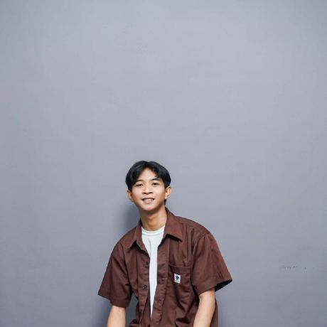
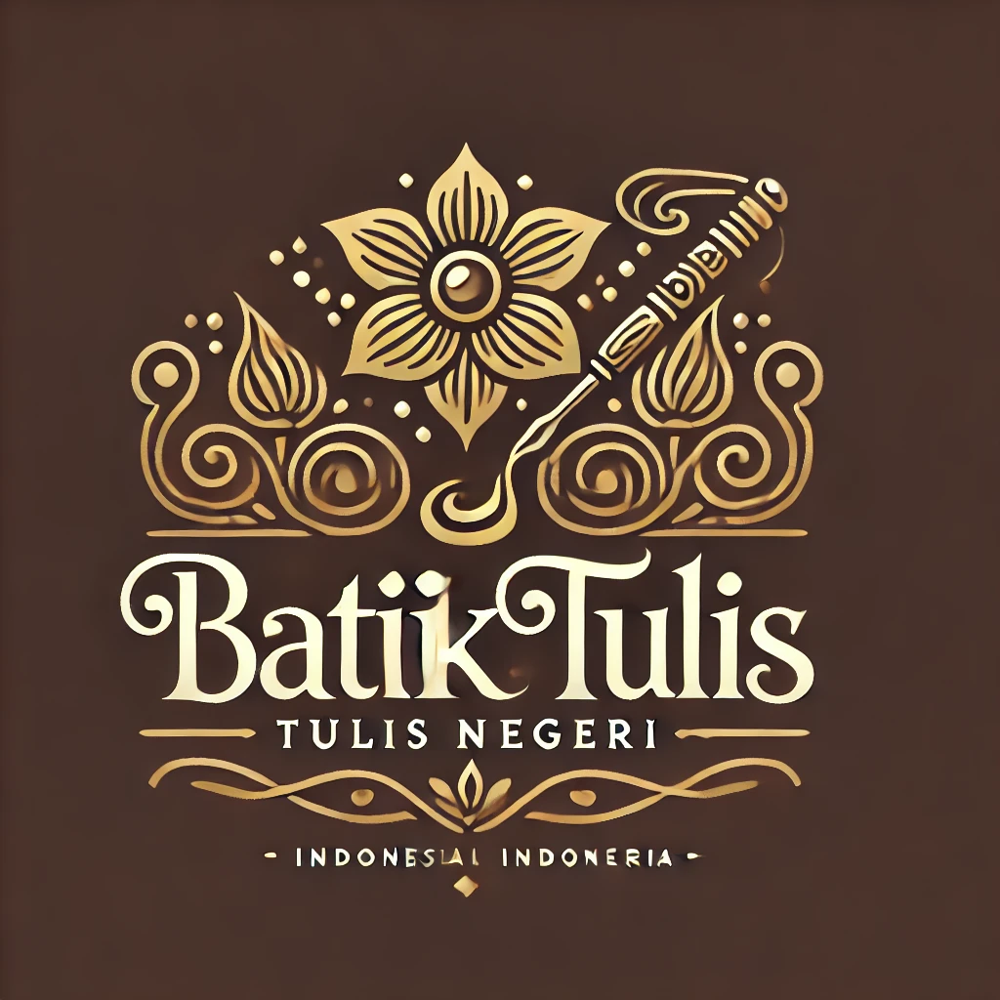
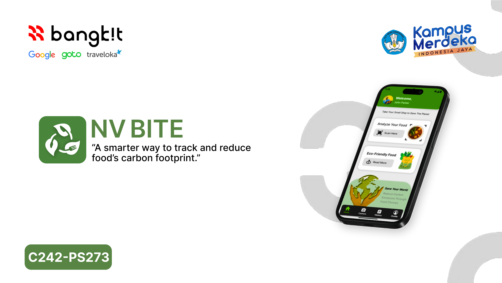

<div align="center">


<br>



<br><br>


<br><br>

<a href="https://github.com/TeguhAldianto">

</a>

<a href="https://www.linkedin.com/in/teguh-aldianto-705b53298">

</a>

<a href="mailto:aldinamanya08@gmail.com">

</a>

<br><br>


</div>

---

<div align="center">

## ⚡ Engineering Mindset

### "First, solve the problem. Then, write the code."

</div>

I am a software engineer focused on building **web applications, backend systems, REST APIs, business applications, and digital products**.

I enjoy transforming business requirements into software systems with a strong focus on:

```text
🏗️ Software Architecture
⚙️ Backend Engineering
🌐 Full Stack Development
🗄️ Database Design
🔐 Authentication & Security
🚀 Performance & Scalability
🧪 Testing & Code Quality
🤖 AI-Assisted Development
```

My development philosophy is simple:

> **Understand the problem → design the system → build the solution → test → optimize → continuously improve.**

---

# 🧠 About Me

<table>
<tr>

<td width="55%" valign="top">

### 👨‍💻 Software Engineer

I build software by combining **business understanding**, **system design**, **backend engineering**, and **modern frontend development**.

My experience spans from Laravel-based business systems to modern **Next.js + TypeScript** applications.

I am particularly interested in:

* scalable application architecture
* RESTful API design
* database modeling
* authentication and authorization
* payment integration
* admin dashboards
* business process digitalization
* application performance
* secure backend systems
* AI-assisted software development

</td>

<td width="45%" align="center">


<br><br>


</td>

</tr>
</table>

---

# 🏗️ What I Build

<div align="center">

<table>
<tr>

<td align="center" width="25%">

## 🧩

### System Design

Architecture
Data Flow
Scalability
Modularity

</td>

<td align="center" width="25%">

## ⚙️

### Backend

REST API
Business Logic
Authentication
Database

</td>

<td align="center" width="25%">

## 🎨

### Full Stack

Next.js
React
TypeScript
Tailwind

</td>

<td align="center" width="25%">

## 🚀

### Production

Security
Testing
Performance
Deployment

</td>

</tr>
</table>

</div>

---

# 🛠️ Technology Stack

<div align="center">

### 🌐 Frontend


<br><br>

### ⚙️ Backend


<br><br>

### 🗄️ Database


<br><br>

### 📱 Mobile


<br><br>

### 🧰 Development Tools


</div>

---

# 🧬 Engineering Stack

<div align="center">

| Layer                    | Technologies                                                 |
| :----------------------- | :----------------------------------------------------------- |
| **Frontend**             | Next.js • React • TypeScript • Tailwind CSS                  |
| **Backend**              | Laravel • PHP • Node.js • REST API                           |
| **Database**             | MySQL • PostgreSQL • SQLite                                  |
| **ORM**                  | Prisma • Eloquent                                            |
| **Authentication**       | Auth.js / NextAuth • Session-based Authentication            |
| **Architecture**         | Clean Architecture • Modular Architecture • RESTful Services |
| **Payments**             | Midtrans                                                     |
| **Mobile**               | Kotlin • Android • MVVM • Retrofit                           |
| **DevOps**               | Git • GitHub • Docker • Linux                                |
| **Development Workflow** | AI-Assisted Development • Code Review • Refactoring          |

</div>

---

# 🚀 Featured Projects

## 🛍️ BATITUNE

<div align="center">

<a href="https://github.com/TeguhAldianto/batitune-batik">



</a>

### Batik Tulis E-Commerce Platform

</div>

BATITUNE is a web-based e-commerce platform designed to digitalize the sales and management process of a Batik Tulis business.

### ✨ Features

```text
🛒 Product Catalog
🔎 Product Search & Filtering
📦 Product Detail Management
🛍️ Shopping Cart
💳 Midtrans Payment Gateway
📋 Checkout Workflow
📊 Admin Dashboard
📦 Stock Management
👥 Customer Management
🧾 Order Management
📈 Sales & Transaction Reporting
⭐ Product Reviews
```

### 🧱 Technology

<p>


</p>

<a href="https://github.com/TeguhAldianto/batitune-batik">


</a>

---

## 🏸 BadmintonKu

<div align="center">

<a href="https://github.com/TeguhAldianto/badmintonku">


</a>

### Online Badminton Court Booking Platform

</div>

A modern full-stack booking system for badminton courts.

### ⚡ Core Workflow

```text
Customer
   │
   ├── Browse Courts
   ├── Select Date
   ├── Select Time
   ├── Create Booking
   ├── Choose Payment
   └── Receive Booking Information
            │
            ▼
      Application Layer
            │
            ├── Authentication
            ├── Validation
            ├── Booking Rules
            ├── Payment Flow
            ├── Notification
            └── Admin Management
            │
            ▼
         Database
```

### ✨ Features

* User registration and authentication
* Court availability
* Date and time scheduling
* Booking management
* Payment workflow
* Payment confirmation
* Booking history
* WhatsApp notifications
* Admin dashboard
* Revenue monitoring
* Booking management

### 🧱 Technology

<p>


</p>

<a href="https://github.com/TeguhAldianto/badmintonku">


</a>

---

## 🏡 Kimmy Kost

<div align="center">

<a href="https://github.com/TeguhAldianto/Project-KimmyKos">


</a>

### RESTful Backend API

</div>

A Laravel backend service designed to provide structured application data for a Next.js frontend.

### 🔌 API Domains

```text
/api/locations
/api/gallery
/api/testimonials
```

### ✨ Responsibilities

```text
🏢 Location Management
🖼️ Gallery Management
⭐ Testimonials
🔌 REST API
🗄️ Database Integration
🌐 Next.js Integration
```

### 🧱 Technology

<p>


</p>

<a href="https://github.com/TeguhAldianto/Project-KimmyKos">


</a>

---

## 💰 Corporate Cash Management System

<div align="center">


### Internal Financial Management System

</div>

An internal application developed during internship experience for supporting financial and business process management.

### ✨ Features

* Cash flow management
* Financial reporting
* Dashboard
* User management
* Digital business processes
* Data management

### 🧱 Technology

<p>


</p>

---

## 🌱 NVBite

<div align="center">



### Food Carbon Emission Estimation App

</div>

Developed during **Bangkit Academy 2024**.

NVBite is an Android application designed to estimate food-related carbon emissions while consuming backend data through a REST API.

### ✨ Features

* Carbon emission estimation
* REST API integration
* Android application
* MVVM architecture
* Network communication using Retrofit

### 🧱 Technology

<p>


</p>

---

# 🎨 Portfolio Engineering

<div align="center">

<a href="https://github.com/TeguhAldianto/portofolionextjs">


</a>

### Modern Portfolio Stack


<br><br>


</div>

My portfolio development is moving toward a modern full-stack TypeScript ecosystem using **Next.js 16, React 19, TypeScript, Tailwind CSS 4, Motion, Recharts, and Vercel Analytics**.

---

# 🧭 Engineering Evolution

<div align="center">

```text
        PHP / Laravel
              │
              ▼
       Backend Development
              │
              ▼
          REST APIs
              │
              ▼
      Database Engineering
              │
              ▼
      Full Stack Development
              │
              ▼
       React / Next.js
              │
              ▼
         TypeScript
              │
              ▼
        System Design
              │
              ▼
    Scalable Production Systems
```

</div>

---

# 📚 Research & Publication

<div align="center">

## 📖 ICASVI 2025

### Published Author

**Research Area**

`Software Innovation` • `Digital Transformation` • `Applied Technology`

</div>

---

# 🎓 Certifications & Learning

<div align="center">

<table>
<tr>

<td align="center">
🎓<br>
<b>Bangkit Academy 2024</b>
</td>

<td align="center">
📱<br>
<b>Kotlin Programming</b>
</td>

<td align="center">
🌐<br>
<b>Web Programming</b>
</td>

<td align="center">
🤖<br>
<b>Basic AI</b>
</td>

</tr>
</table>

</div>

---

# 🔭 Currently Learning

<div align="center">


</div>

### Current Technical Priorities

```text
01 ─ System Design
02 ─ Backend Architecture
03 ─ API Design
04 ─ Database Engineering
05 ─ Application Security
06 ─ Performance Optimization
07 ─ DevOps & Deployment
08 ─ AI-Assisted Engineering
```

---

# 📈 Contribution Activity

<div align="center">


</div>

---

# 💻 Development Philosophy

<div align="center">

<table>
<tr>

<td align="center" width="20%">

### 01

🧠

**Understand**

</td>

<td align="center">

→

</td>

<td align="center" width="20%">

### 02

🏗️

**Design**

</td>

<td align="center">

→

</td>

<td align="center" width="20%">

### 03

⚙️

**Build**

</td>

<td align="center">

→

</td>

<td align="center" width="20%">

### 04

🧪

**Test**

</td>

<td align="center">

→

</td>

<td align="center" width="20%">

### 05

🚀

**Improve**

</td>

</tr>
</table>

</div>

---

# 🤝 Connect With Me

<div align="center">

<a href="https://github.com/TeguhAldianto">

</a>

<a href="https://www.linkedin.com/in/teguh-aldianto-705b53298">

</a>

<a href="mailto:aldinamanya08@gmail.com">

</a>

</div>

---

<div align="center">

### ⚡ Build. Learn. Refactor. Repeat.

<br>


<br><br>


</div>
